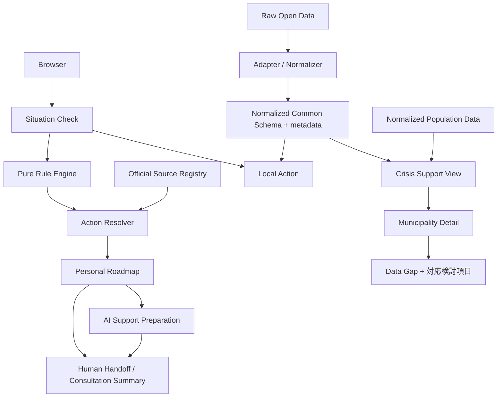

# Architecture

主要判断は `generateActions(situation, context)` のような純粋関数で行う。UIは生データやURLを直接持たず、Source Registry と正規化スキーマを参照する。公式情報は確認すべき事項、Open Dataは地域資源・支援準備を担当する。外部データは取得・正規化して同梱し、画面表示時のネットワーク障害を避ける。

AI Support PreparationはCloudflare Workers AI bindingを使う独立した補助導線で、相談画面に入力した会話だけを送信する。Situation Checkの回答、Rule Engineの判断、Source Registryはモデル入力にせず、モデル障害時も主要導線を維持する。
