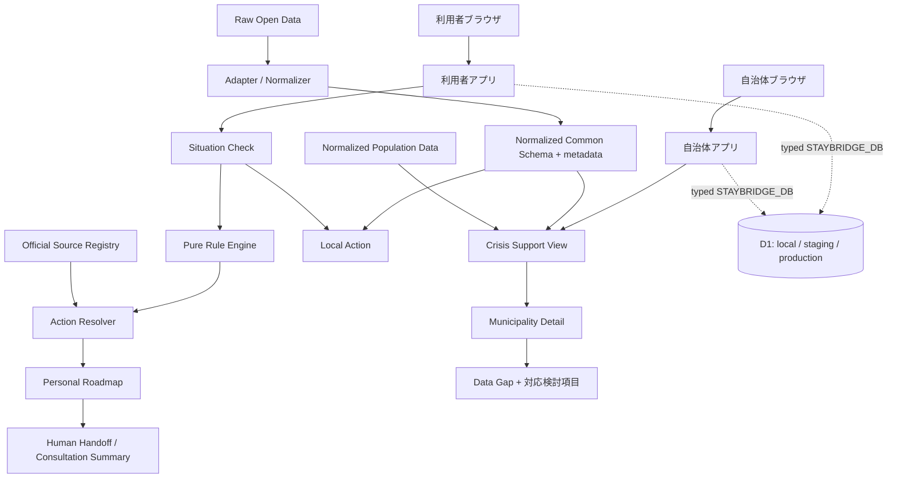

# Architecture

主要判断は `generateActions(situation, context)` のような純粋関数で行う。利用者アプリと自治体アプリは別々にビルドされ、domain/data/worker-runtimeのworkspace packageを共有する。両Workerは型付き`STAYBRIDGE_DB` Bindingを持ち、利用者Workerだけがversion付き同意を検証してSituation回答を公開routeから保存する。会話テーブルへの作成は公開せず、#62のserver生成経路がserver-internal関数を呼ぶ場合だけ、NFKC正規化、識別子拒否、連絡先等のマスキング、固定model/trusted source検証を終えてから保存する。自治体WorkerとCrisis Viewには会話本文のrouteを設けない。D1の運用契約は [Workers・D1バックエンド基盤](backend-d1.md) を参照する。UIは生データやURLを直接持たず、Source Registry と正規化スキーマを参照する。公式情報は確認すべき事項、Open Dataは地域資源・支援準備を担当する。外部データは取得・正規化して同梱し、画面表示時のネットワーク障害を避ける。
