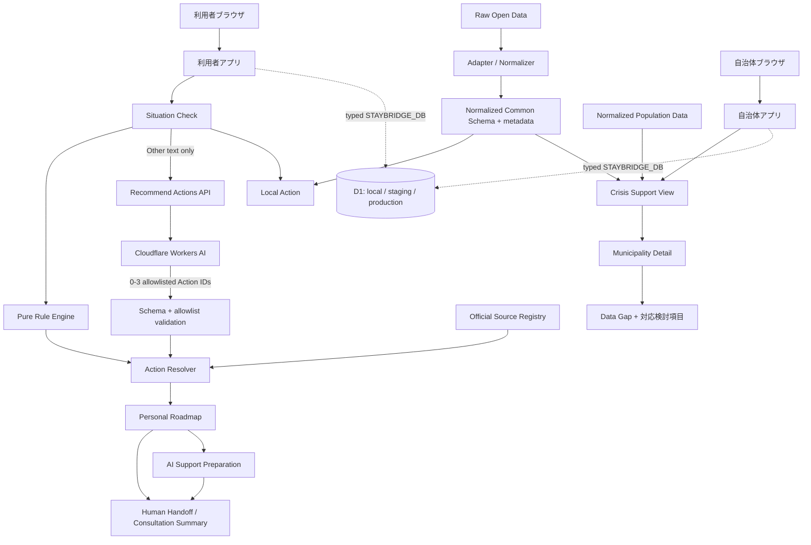

# Architecture

主要判断は `generateActions(situation, context)` のような純粋関数で行う。利用者アプリと自治体アプリは別々にビルドされ、domain/data/worker-runtimeのworkspace packageを共有する。両Workerは型付き`STAYBRIDGE_DB` Bindingを持つが、Situation CheckやCrisis Viewの永続化はまだ行わない。D1の運用契約は [Workers・D1バックエンド基盤](backend-d1.md) を参照する。UIは生データやURLを直接持たず、Source Registry と正規化スキーマを参照する。公式情報は確認すべき事項、Open Dataは地域資源・支援準備を担当する。外部データは取得・正規化して同梱し、画面表示時のネットワーク障害を避ける。

AI Support Preparationは利用者Worker内のCloudflare Workers AI bindingを使う独立した補助導線で、相談画面に入力した会話だけを送信する。Situation Checkの回答、Rule Engineの判断、Source Registryはモデル入力にせず、モデル障害時も主要導線を維持する。クライアント由来の会話履歴はroleを信頼せず、区切られたJSON transcriptを単一のuser messageとして推論へ渡す。

来日目的「その他」の自由記述だけは `/api/recommend-actions` からWorkers AIへ送り、許可済みAction IDを最大3件追加する。APIは実読込バイト数を制限し、利用元別・全体のRate Limiting bindingをAI呼出前に適用する。AI結果はRule Engineの結果を削除・上書きできず、通信失敗時は空の追加候補として扱う。
