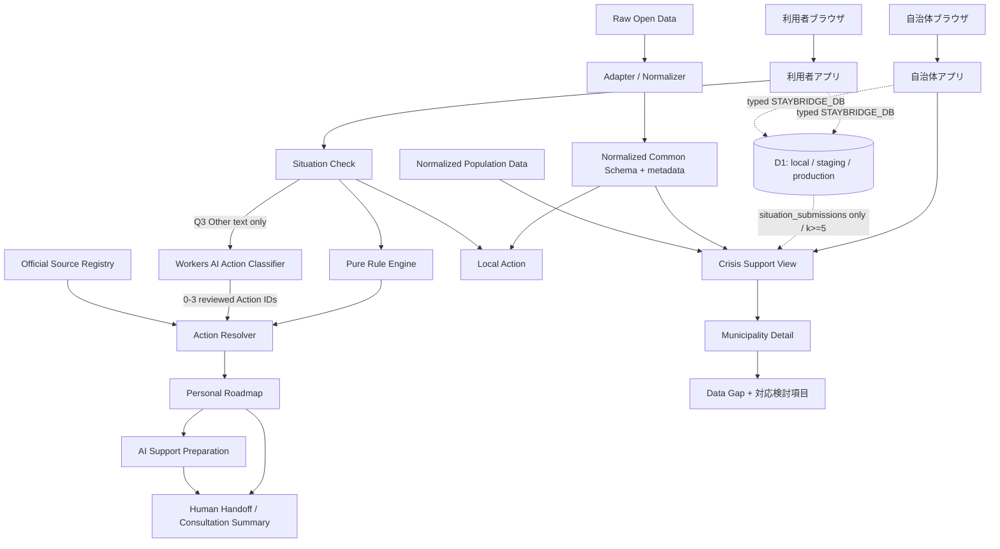

# Architecture

主要判断は `generateActions(situation, { asOfDate, stayAnswer })` の純粋関数で行う。`packages/domain/src/rules.ts` の固定ルール表が型付き回答コードをRule IDへ対応させ、Action IDごとに決定的に重複排除する。Action Resolverは勝者のRule ID・回答コードを保持したまま、`action-catalog.ts` とSource Registryからレビュー済みカードを解決する。Rule EngineはAI、外部API、D1、表示ラベル、現在時計を参照しない。

QUESTION 01・02・03・07の自由記述は`Situation`と分けたsession v4の`otherAnswers`で保持する。選択した「その他」が空欄ならanswered stepから除外するため、戻る・reload・旧session移行でも未回答のまま進めない。Q3分類結果は元のtrim済みQ3文字列とAction IDを組にして保持し、文字列不一致、無効ID、Q3変更、restartでは破棄する。これらはD1のSituation保存payloadへ含めない。

`POST /api/recommend-actions` は利用者Workerの専用境界で、Q3の`text` 1項目だけを受け取る。同一origin、JSON、2,000 bytes、300文字、文書番号拒否、連絡先等のmask、`OTHER_ACTIONS_RATE_LIMITER`、10秒のserver timeoutを適用する。モデル入力はtrusted system promptと区切ったuntrusted Q3 JSONだけで、応答は手動allowlistの一意な0〜3 Action ID以外を全体rejectする。クライアントも同じ契約を再検証し、公開期限内の静的カタログカードだけをpriority 55でRule Engine結果へunionする。同一IDはRule Engine側を保持し、失敗・不正・late responseは空の補助結果として扱う。

利用者アプリと自治体アプリは別々にビルドされ、domain/data/worker-runtimeのworkspace packageを共有する。両Workerは型付き`STAYBRIDGE_DB` Bindingを持つ。利用者Workerは同一originへ短命の署名済みSituation capabilityを発行し、version・期限・nonce・scopeとversion付き同意を検証して、one-time消費と回答INSERTを同じD1 batchで行う。検証済み行だけを`accepted`とし、検証不能な既存行は`quarantined`に分離する。自治体Workerは固定`GET /api/crisis/needs`で`accepted`の`situation_submissions`のみを読み、自治体・東京暦期間・単一allowlist軸ごとに、最小公開件数k=5で少数データを抑制したsubmission単位の集計だけをCrisis Viewへ渡す。会話テーブルへの作成は公開せず、#62のserver生成経路がserver-internal関数を呼ぶ場合だけ、NFKC正規化、識別子拒否、連絡先等のマスキング、固定model/trusted source検証を終えてから保存する。自治体WorkerとCrisis Viewには会話本文・会話集計・個票routeを設けない。D1の運用契約は [Workers・D1バックエンド基盤](backend-d1.md) を参照する。UIは生データやURLを直接持たず、Source Registry と正規化スキーマを参照する。公式情報は確認すべき事項、Open Dataは地域資源・支援準備を担当する。外部データは取得・正規化して同梱し、画面表示時のネットワーク障害を避ける。

AI Support Preparationは利用者Worker内の同じCloudflare Workers AI bindingを使う別の補助導線で、相談画面に入力した会話だけを送信する。Q3分類とはroute、request schema、rate-limit binding、prompt、response contractを共有しない。Situation Checkの回答、Rule Engineの判断、Source Registryはチャットのモデル入力にせず、モデル障害時も主要導線を維持する。クライアント由来の会話履歴はroleを信頼せず、区切られたJSON transcriptを単一のuser messageとして推論へ渡す。
