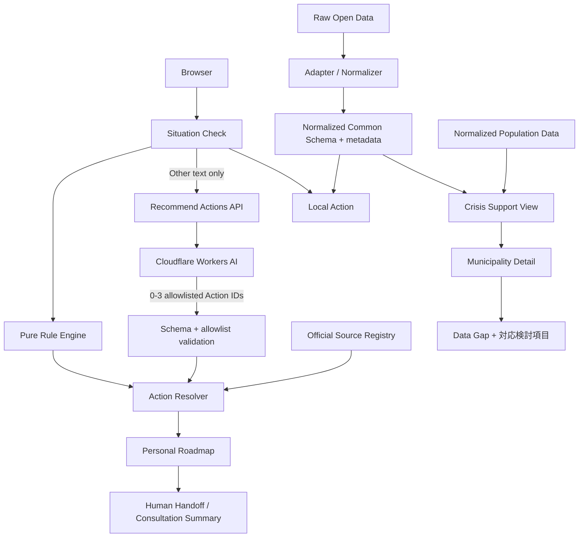

# Architecture

主要判断は `generateActions(situation, context)` の純粋関数で行う。「その他」の自由記述だけはサーバーAPIからWorkers AIへ送り、許可済みAction IDを最大3件追加する。APIは実読込バイト数を制限し、利用元別・全体のRate Limiting bindingをAI呼出前に適用する。AI結果はRule Engineの結果を削除・上書きできず、通信失敗時は空の追加候補として扱う。UIは生データやURLを直接持たず、Source Registry と正規化スキーマを参照する。公式情報は確認すべき事項、Open Dataは地域資源・支援準備を担当する。外部データは取得・正規化して同梱し、画面表示時のネットワーク障害を避ける。
